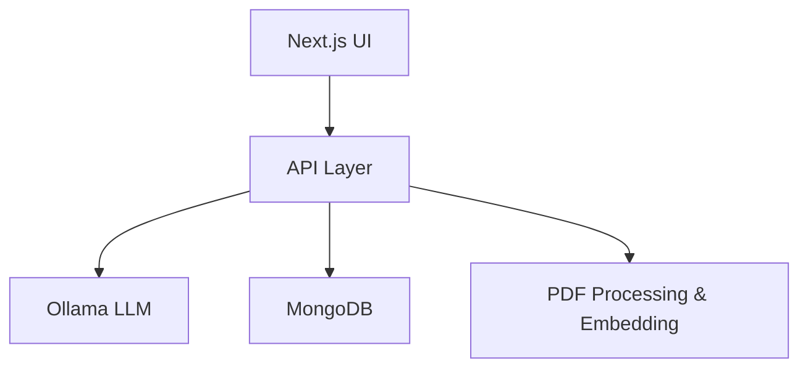

# 🦾 Drive-Assist: Offline RAG Chatbot


[](https://github.com/sharathpc/drive-assist/blob/main/LICENSE)

**Drive-Assist** is an offline-first Retrieval-Augmented Generation (RAG) chatbot that lets you chat with your own PDFs using Ollama LLM, MongoDB, and Next.js—all running locally with Docker Compose.

---

## 🖼️ UI Preview

- **User View**: Chat with the bot, upload PDFs, and get instant answers in a clean, modern interface.
- **Admin View**: Manage uploaded files, review user feedback, and monitor chat activity.


---

## 🏗️ Architecture



---

## ✨ Features
- **Offline-first**: All services run locally
- **PDF Q&A**: Upload PDFs and ask questions
- **RAG Pipeline**: Combines retrieval (LangChain) and generation (Ollama)
- **Modern UI**: User/admin views with file management
- **Dockerized**: One-command startup

---

## 🚀 Quickstart

1. **Clone the repo**
   ```bash
   git clone https://github.com/sharathpc/drive-assist.git
   cd drive-assist
   ```
2. **Start everything**
   ```bash
   docker compose up --build
   ```
3. **Open your browser**
   Visit [http://localhost:3000](http://localhost:3000)

---

## 🐳 Docker Compose (excerpt)
```yaml
services:
  ollama:
    image: ollama/ollama:0.3.5
    ports: ["11434:11434"]
    volumes:
      - ollama:/root/.ollama
      - ./entrypoint.sh:/entrypoint.sh
    entrypoint: ["/usr/bin/bash", "/entrypoint.sh"]
    restart: always
  mongodb:
    build: { context: ./mongodb_rs }
    environment:
      MONGO_INITDB_ROOT_USERNAME: admin
      MONGO_INITDB_ROOT_PASSWORD: password
      MONGO_INITDB_DATABASE: db
    ports: ["27017:27017"]
    depends_on: [ollama]
  nextjs-ui:
    build: { context: ./, dockerfile: dev.DockerFile }
    environment:
      NEXT_PUBLIC_APPLICATION_NAME: ${NEXT_PUBLIC_APPLICATION_NAME}
      MONGODB_URL: ${MONGODB_URL}
      OLLAMA_URL: ${OLLAMA_URL}
      OLLAMA_MODEL: ${OLLAMA_MODEL}
      OLLAMA_EMBEDDINGS_MODEL: ${OLLAMA_EMBEDDINGS_MODEL}
    ports: ["3000:3000"]
    volumes:
      - ./src:/app/src
      - ./public:/app/public
    depends_on: [ollama, mongodb]
volumes:
  ollama:
  mongodb_data:
  mongodb_config:
```

---

## 🧩 How It Works
- **UI**: Next.js app for chat, PDF upload, admin tools
- **API**: Handles chat, file upload, document processing
- **Database**: MongoDB stores chat, files, feedback
- **LLM**: Ollama runs locally for fast, private inference
- **Embedding**: LangChain splits and embeds PDFs for retrieval

---

## 📖 Learn More
- Full technical article: [Medium Article](https://github.com/sharathpc/drive-assist)
- Source code: [https://github.com/sharathpc/drive-assist](https://github.com/sharathpc/drive-assist)

---

**Questions or suggestions? Open an issue or PR! 🚗💬** 